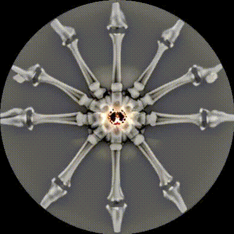

# Controlnet-watchfaces - Android Watchfaces generated with Stable Diffusion and Controlnet and based on examples from:

This makes use of clockfaces generated for KindleTimeMachine, with ner ones generated to match circular screens and analogue clocks : https://github.com/diggedypomme/KindleTimeMachine

--
 
## Table of Contents

- [Installation](#installation)
- [Usage](#usage)
- [Preview](#preview)
- [Folder Structure](#folder-structure)
- [Contributing](#contributing)
- [License](#license)

## Preview

Here are some of the generated GIFs showing different watchfaces:

- **coral.gif**
    

- **duneworms.gif**
    

- **flowers_jpg.gif**
    

- **newbones.gif**
    

- **newtentacles.gif**
    

- **oldtentacles.gif**
    

- **parrots.gif**
    

- **snakes.gif**
    

## Folder Structure

